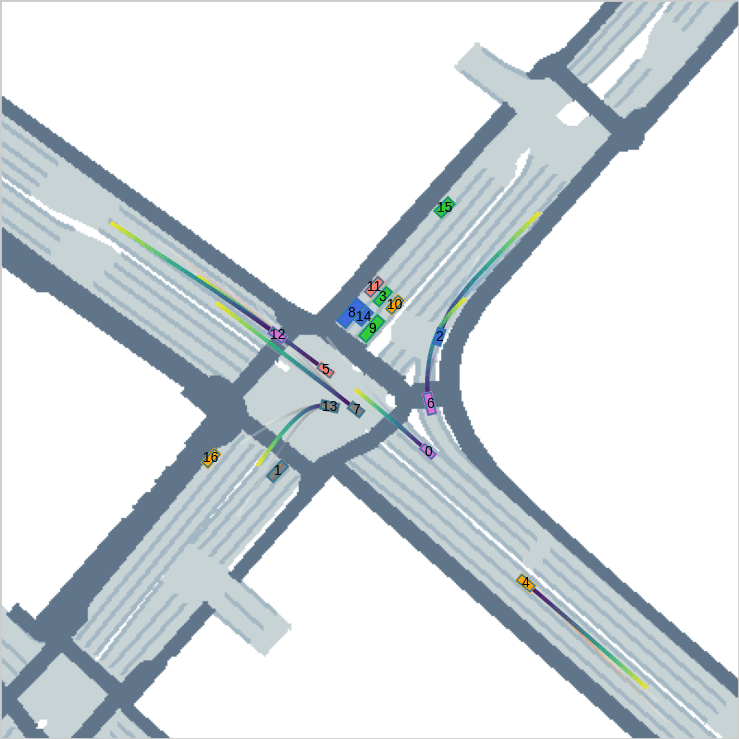

# Controllable Traffic Generation (CTG)
Codebase of Controllable Traffic Generation (CTG) and Controllable Traffic Generation Plus Plus (CTG++). 

This repo is mostly built on top of [traffic-behavior-simulation (tbsim)](https://github.com/NVlabs/traffic-behavior-simulation). The diffusion model part is built on top of initial implementation in [Diffuser](https://github.com/jannerm/diffuser). It also lightly uses [STLCG](https://github.com/StanfordASL/stlcg).

# Pre-Trained Visualization



## Installation
### Basic (mainly based on tbsim)
Create conda environment (Note nuplan-devkit needs `python>=3.9` so the virtual environment with python version 3.9 needs to be created instead of python 3.8.)
```angular2html
conda create -n bg3.8 python=3.8
conda activate bg3.8
sudo chmod +x setup.bash
```

Install `CTG` (this repo)
```angular2html
git clone https://github.com/NVlabs/CTG.git
cd CTG
pip install -e .
```

Install a customized version of `trajdata`
```angular2html
cd ..
git clone https://github.com/AIasd/trajdata.git
cd trajdata
pip install -r trajdata_requirements.txt
pip install -e .
```

Install `Pplan`
```angular2html
cd ..
git clone https://github.com/NVlabs/spline-planner.git Pplan
cd Pplan
pip install -e .
```

### Potential Issue
One might need to run the following:
```angular2html
pip install torch==1.11.0+cu113 torchvision==0.12.0+cu113 torchaudio==0.11.0 torchmetrics==0.11.1 torchtext --extra-index-url https://download.pytorch.org/whl/cu113
```


### Extra Setup for STL (CTG)
Install STLCG and switch to `dev` branch
```angular2html
cd ..
git clone https://github.com/StanfordASL/stlcg.git
cd stlcg
pip install graphviz
pip install -e .
git checkout dev
```


### Extra Setup for ChatGPT API (if using lanugage interface of CTG++)
```
pip install openai
pip install tiktoken
```
Create a file `openai_key.py` and put your openai key in it with the variable name `openai_key`.

## Quick start
### 1. Obtain dataset(s)
We currently support the nuScenes [dataset](https://www.nuscenes.org/nuscenes).


#### nuScenes
* Download the nuScenes dataset (with the v1.3 map extension pack) and organize the dataset directory as follows:
    ```
    nuscenes/
    │   maps/
    │   v1.0-mini/
    │   v1.0-trainval/
    ```


### 2. Train a diffuser model
nuScenes dataset (Note: remove `--debug` flag when doing the actual training and to support wandb logging):
```
python scripts/train.py --dataset_path <path-to-nuscenes-data-directory> --config_name trajdata_nusc_diff --debug
```

A concrete example (CTG):
```
python scripts/train.py --dataset_path ../behavior-generation-dataset/nuscenes --config_name trajdata_nusc_diff --debug
```

A concrete example (CTG++):
```
python scripts/train.py --dataset_path ../behavior-generation-dataset/nuscenes --config_name trajdata_nusc_scene_diff --debug
```

### 3. Run rollout of a trained model (closed-loop simulation)
Run Rollout
```
python scripts/scene_editor.py \
  --results_root_dir nusc_results/ \
  --num_scenes_per_batch 1 \
  --dataset_path <path-to-nuscenes-data-directory> \
  --env trajdata \
  --policy_ckpt_dir <path-to-checkpoint-dir> \
  --policy_ckpt_key <ckpt-file-identifier> \
  --eval_class <class-of-model-to-rollout> \
  --editing_source 'config' 'heuristic' \
  --registered_name 'trajdata_nusc_diff' \
  --render
```

The following is a concrete example for running CTG (when using the pre-trained model):
```
python scripts/scene_editor.py \
  --results_root_dir nusc_results/ \
  --num_scenes_per_batch 1 \
  --dataset_path ../behavior-generation-dataset/nuscenes \
  --env trajdata \
  --policy_ckpt_dir ../../summer_project/behavior-generation/trained_models_only_new/trajdata_nusc/ctg_original \
  --policy_ckpt_key iter70000.ckpt \
  --eval_class Diffuser \
  --editing_source 'config' 'heuristic' \
  --registered_name 'trajdata_nusc_diff' \
  --render
```

The following is a concrete example for running CTG++ (when using the pre-trained model):
```
python scripts/scene_editor.py \
  --results_root_dir nusc_results/ \
  --num_scenes_per_batch 1 \
  --dataset_path ../behavior-generation-dataset/nuscenes \
  --env trajdata \
  --policy_ckpt_dir ../../summer_project/behavior-generation/trained_models_only_new/trajdata_nusc/ctg++8_9,10edge \
  --policy_ckpt_key iter50000.ckpt \
  --eval_class SceneDiffuser \
  --editing_source 'config' 'heuristic' \
  --registered_name 'trajdata_nusc_scene_diff' \
  --render
```

### 4.Parse Results for rollout
```
python scripts/parse_scene_edit_results.py --results_dir
 <rollout_results_dir> --estimate_dist
```

## Pre-trained models
We have provided checkpoints for models of CTG and CTG++ [here](https://drive.google.com/drive/folders/17oYCNGTzBPWjKqvvA8JO67WswyI0j5vw?usp=sharing). 
Note that the provided CTG model slightly differ from that in the original CTG paper. The main difference is that the prediction horizon is 52 rather than 20. The pre-trained models are provided under the **CC-BY-NC-SA-4.0 license**.

## Configurations
check out `class DiffuserConfig` and `class SceneDiffuserConfig` in `algo_config.py` for algorithm configs, `trajdata_nusc_config.py` for dataset configs, and `scene_edit_config.py` for rollout configs (including changing the guidance used during denoising).


## References
If you find this repo useful, please consider to cite our relevant work: 

```
@INPROCEEDINGS{10161463,
  author={Zhong, Ziyuan and Rempe, Davis and Xu, Danfei and Chen, Yuxiao and Veer, Sushant and Che, Tong and Ray, Baishakhi and Pavone, Marco},
  booktitle={2023 IEEE International Conference on Robotics and Automation (ICRA)}, 
  title={Guided Conditional Diffusion for Controllable Traffic Simulation}, 
  year={2023},
  volume={},
  number={},
  pages={3560-3566},
  doi={10.1109/ICRA48891.2023.10161463}}

```

```
@inproceedings{
zhong2023languageguided,
title={Language-Guided Traffic Simulation via Scene-Level Diffusion},
author={Ziyuan Zhong and Davis Rempe and Yuxiao Chen and Boris Ivanovic and Yulong Cao and Danfei Xu and Marco Pavone and Baishakhi Ray},
booktitle={7th Annual Conference on Robot Learning},
year={2023},
url={https://openreview.net/forum?id=nKWQnYkkwX}
}
```
